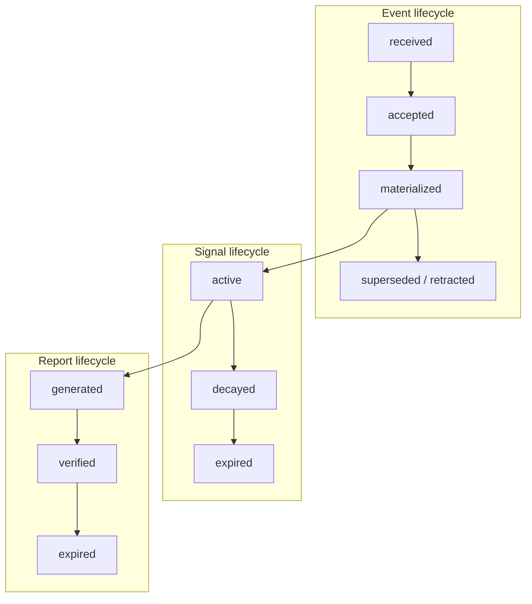
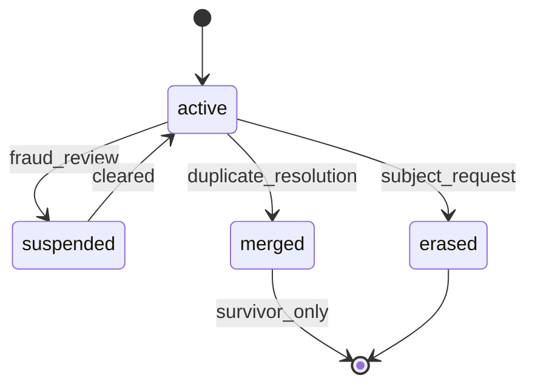

# Trust Lifecycle

The trust lifecycle spans creation, maturation, correction, consumption, and retirement of trust artifacts.

## Lifecycle domains

## Event lifecycle

| State | Description | Consumer visibility |
|-------|-------------|---------------------|
| `received` | Awaiting validation | None |
| `accepted` | Passed policy checks | None until materialized |
| `materialized` | Signals written | Indirect via scores |
| `superseded` | Replaced by correction | Updated outcomes only |
| `retracted` | Withdrawn by producer/registry | Excluded from new lookups |
| `rejected` | Terminal validation failure | None |

Correction events link forward via `corrects_event_id`. Retraction events link via `retracts_event_id`.

## Signal lifecycle

Signals become **active** when materialized from accepted events. Over time:

1. **Decay** — influence weight diminishes per context policy (e.g., exponential half-life for repayment signals).
2. **Supersession** — newer contradictory signals adjust polarity.
3. **Expiration** — ephemeral signals (promotional badges) reach `expires_at` and leave active set.

The intelligence engine **MUST** recompute scores when signal state changes.

## Context score lifecycle

Context scores are derived artifacts, not source records:

| Phase | Behavior |
|-------|----------|
| **Bootstrap** | Thin-data band until minimum signal threshold |
| **Active** | Regular refresh on new events |
| **Stale** | Flagged when no fresh signals within context TTL |
| **Suppressed** | Subject or registry blocks consumer visibility |

## Report lifecycle

| Phase | Duration | Notes |
|-------|----------|-------|
| **Generated** | Point-in-time snapshot | Includes `generated_at` |
| **Verifiable** | Default 90 days | Verify URI confirms integrity |
| **Expired** | After TTL | Returns `PTI-4042` on verify |

Consumers **SHOULD NOT** treat expired reports as current truth without regeneration.

## Identity lifecycle

- **Merged** identities redirect all lookups to survivor `pti_id`.
- **Erased** identities trigger cascade deletion per governance policy.

## Consent lifecycle

Consent grants bind consumer, context, and purpose. Withdrawal suppresses restricted fields on subsequent lookups within policy SLA (typically 24 hours).

## Operational SLAs (informative defaults)

| Transition | Target SLA |
|------------|------------|
| Event → materialized signal | &lt; 5 minutes (async) |
| Retraction → lookup exclusion | &lt; 1 hour |
| Erasure → lookup block | &lt; 24 hours |
| Score refresh after materialization | &lt; 15 minutes |

## Related pages

- [Trust Events](./trust-events)
- [Governance Specification](/pti/specification/v1.0/governance)
- [Reference Event Model](/pti/specification/v1.0/reference-event-model)
