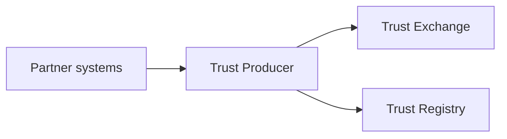

# Trust Producers

Trust producers generate trust signals by ingesting verifiable activity about subjects they serve.

## Producer role

Producers **MUST NOT** consume institutional lookup APIs using producer credentials for unrelated decision workflows — separate consumer entitlements apply.

## Producer categories

| Category | Examples | Typical signals |
|----------|----------|-----------------|
| **Financial** | Lenders, wallets, remittance operators | Repayment, default, transfer |
| **Commerce** | Marketplaces, payment facilitators | Settlement, chargeback |
| **Property** | Landlords, property managers | Lease performance |
| **Employment** | Employers, HR platforms | Tenure, verification |
| **Community** | Cooperatives, stokvels | Group contribution |
| **Verifiers** | ID issuers, accreditors | Document and badge evidence |

## Obligations

Producers **MUST**:

1. Emit only entitled `event_type` and `context_id` pairs.
2. Resolve subjects to `pti_id` before ingest when possible.
3. Supply stable `idempotency_key` values per business action.
4. Honor correction and retraction workflows.
5. Maintain mapping documentation for partner entity identifiers.

## Integration patterns

| Pattern | When to use |
|---------|-------------|
| **Real-time API** | High-value transactional signals |
| **Webhook** | Partner-controlled event fan-out |
| **Scheduled CSV** | Historical backfill or low-frequency batches |
| **Managed connector** | SaaS systems without custom development |

## Quality management

Producers **SHOULD** monitor:

| Metric | Target |
|--------|--------|
| Validation error rate | &lt; 1% of records |
| Idempotency conflict rate | Near zero after stabilization |
| Resolution failure rate | Investigate above 5% |
| Median ingest latency | Per contractual SLA |

Systematic mapping errors **MUST** trigger producer notification and remediation playbooks.

## Context enablement

Producers enable only contexts they legitimately observe. Enabling `lending` without lending activity violates policy packs and risks entitlement suspension.

## Metering

Compute and ingest volume **MAY** be metered (e.g., Trust Compute Units) for billing and capacity planning. Metering is implementation-specific but **SHOULD NOT** alter event semantics.

## Related pages

- [Trust Events](./trust-events)
- [Trust Exchange](./trust-exchange)
- [Implementation Guide — Best Practices](/pti/implementation-guide/best-practices)
