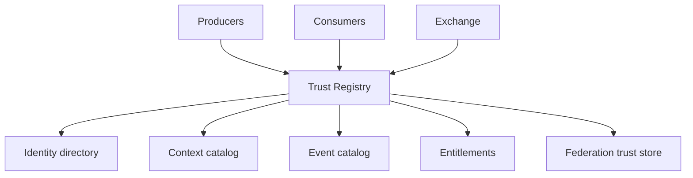

# Trust Registry

The Trust Registry is the authoritative directory for portable identities, trust contexts, event catalogs, and tenant entitlements.

## Registry as anchor

## Identity directory

Maintains:

- `pti_id` allocation and lifecycle state
- Partner entity reference mappings
- Verification level metadata
- Merge history and survivor pointers

### Resolution API

Resolution accepts identity hints and partner references, returning:

- `pti_id`
- `match_confidence`
- `match_method` (`deterministic`, `probabilistic`, `created`)

New subject creation **MUST** occur when no match is permitted and producer is entitled to provision.

## Context catalog

Publishes registered trust contexts:

| Field | Purpose |
|-------|---------|
| `context_id` | Stable identifier |
| `context_tier` | `primary` or `lens` |
| `derivation_rules` | Lens upstream dependencies |
| `signal_policies` | Decay and weight caps |

## Event catalog

Maps `event_type` → payload schema → signal mapping rules. Producers **MUST** consume catalog updates before emitting new types.

## Entitlement registry

Stores tenant grants for contexts, tiers, purpose codes, and geo restrictions. Policy gateways read entitlements on every mutating and lookup operation.

## Federation trust store

Holds public keys and operator metadata for peer registries. Required for cross-operator assertion verification.

## Capabilities endpoint

Exposes supported API versions, schemas, and deprecation notices per [Versioning Strategy](/pti/specification/v1.0/versioning-strategy).

## HA and consistency

- Identity writes **MUST** be strongly consistent within a registry partition.
- Catalog updates **MAY** be eventually consistent with cache TTL ≤ 5 minutes.
- Federation replication **SHOULD** target eventual consistency within 15 minutes.

## Related pages

- [Trust Resolution](./trust-resolution)
- [Authorization Model](/pti/specification/v1.0/authorization-model)
- [Reference API Specification](/pti/specification/v1.0/reference-api-specification)
