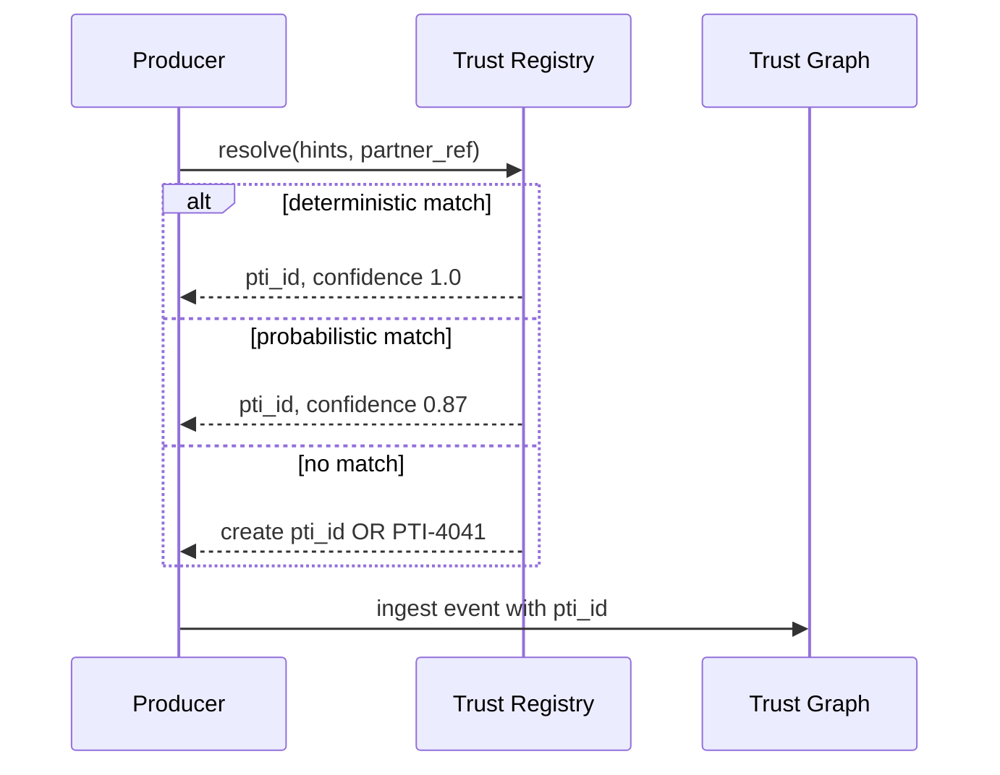

# Trust Resolution

Trust resolution maps partner-local entity identifiers and identity hints to portable `pti_id` values in the Trust Registry.

## Resolution in the flow



## Match methods

| Method | Description | Typical confidence |
|--------|-------------|------------------|
| `deterministic_phone` | Exact E.164 match | 1.0 |
| `deterministic_partner_ref` | Prior linked entity | 1.0 |
| `probabilistic_name_dob` | Fuzzy name + date of birth | 0.7–0.95 |
| `probabilistic_document_hash` | Hashed ID match | 0.9–1.0 |
| `created` | New subject provisioned | 1.0 (new) |

## Resolution inputs

```json
{
  "identity_hints": {
    "phone_e164": "+27821234567",
    "email_hash": "sha256:...",
    "national_id_hash": "sha256:...",
    "name": "Nomvula Mokoena",
    "date_of_birth": "1990-03-15"
  },
  "partner_ref": {
    "partner_id": "prt_acme",
    "entity_id": "cust_9912"
  },
  "create_if_missing": true
}
```

## Merge policy

When duplicate subjects are detected:

1. Score candidate pairs using registry rules
2. Queue manual review if confidence in merge band (e.g., 0.75–0.89)
3. Auto-merge above high threshold with survivor selection rules
4. Emit `identity.merged` webhook
5. Redirect lookups to survivor `pti_id`

Merges **MUST NOT** combine subjects under legal hold or conflicting suppression without operator review.

## Consumer search resolution

Consumers search with partial identifiers. Results return ranked candidates:

```json
{
  "candidates": [
    {"pti_id": "pti_abc", "match_confidence": 0.92, "match_method": "probabilistic_name_dob"},
    {"pti_id": "pti_def", "match_confidence": 0.61, "match_method": "probabilistic_name_dob"}
  ]
}
```

Consumers **SHOULD** require secondary confirmation before high-impact decisions on low-confidence matches.

## External subjects

Subjects not yet in the directory may be:

- Provisioned via producer `create_if_missing`
- Screened via external verification profile
- Invited to claim portable identity through subject onboarding

## Privacy safeguards

Resolution **MUST NOT** expose one subject's full profile to unrelated producers during matching. Only `pti_id` and confidence are returned.

## Related pages

- [Trust Registry](./trust-registry)
- [Trust Graph](./trust-graph)
- [Reference Data Model](/pti/specification/v1.0/reference-data-model)
