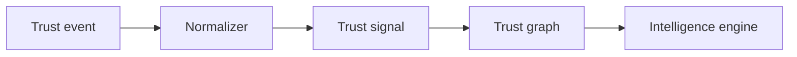

# Trust Signals

Trust signals are normalized, queryable representations of verified activity derived from trust events.

## Signal derivation

Every signal **MUST** trace to a source event except governed manual attestations recorded as events first.

## Signal anatomy

| Field | Purpose |
|-------|---------|
| `signal_id` | Unique identifier |
| `signal_type` | Catalogued classification |
| `pti_id` | Affected subject |
| `context_id` | Life-area scope |
| `polarity` | `positive`, `negative`, `neutral` |
| `weight` | Normalized influence (0.0–1.0) |
| `source_event_id` | Provenance anchor |
| `effective_at` | When signal becomes active |
| `expires_at` | Optional TTL |

## Signal types (examples)

| signal_type | context_id | Typical polarity |
|-------------|------------|------------------|
| `repayment.on_time` | `lending` | positive |
| `repayment.delinquent_30d` | `lending` | negative |
| `lease.completed` | `rental` | positive |
| `employment.tenure_12m` | `employment` | positive |
| `chargeback.opened` | `merchant` | negative |
| `endorsement.peer` | `informal_sector` | positive |

## Normalization rules

The event normalizer applies:

1. **Type mapping** — partner payload → canonical `signal_type`
2. **Polarity assignment** — based on event outcome fields
3. **Weight calibration** — per context policy tables
4. **Deduplication** — collapse duplicate business actions via `idempotency_key`

## Context binding

Signals are strictly context-bound. A merchant chargeback signal **MUST NOT** directly alter lending scores unless a published lens derivation rule explicitly allows cross-context aggregation.

## Decay and aggregation

| Mechanism | Description |
|-----------|-------------|
| **Time decay** | Older signals contribute less to scores |
| **Recency boost** | Recent positive activity may accelerate recovery |
| **Contradiction handling** | Negative signals offset positives within same domain |
| **Floor/ceiling** | Context policies cap single-signal contribution |

## Signal quality indicators

The intelligence engine tracks:

- **Freshness** — time since latest signal
- **Diversity** — count of distinct producers
- **Verification depth** — document vs self-reported
- **Consistency** — contradictory signal detection

These feed **coverage_gaps** and confidence bands in lookup outcomes.

## Anti-poisoning

Exchange policy **SHOULD** detect:

- Abnormal volume spikes from single producer
- Context mismatch patterns
- Circular endorsement rings

Suspicious signals **MAY** be quarantined pending review.

## Related pages

- [Trust Events](./trust-events)
- [Trust Evidence](./trust-evidence)
- [Trust Intelligence Engine](./trust-intelligence-engine)
- [Reference Data Model](/pti/specification/v1.0/reference-data-model)
