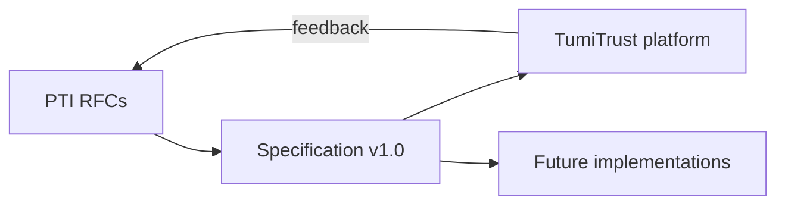

import SpecHero from '@site/src/components/SpecHero';

<SpecHero
  kicker="Reference implementation"
  title="TumiTrust: The PTI Reference Implementation"
  lead="A production deployment that demonstrates how PTI principles operate under real load — not a substitute for the open specification."
  badges={[
    {label: 'Production', variant: 'stable'},
    {label: 'Founding steward', variant: 'default'},
  ]}
/>

A **reference implementation** demonstrates that a specification is implementable, operable, and useful at scale. It contributes operational learnings to RFCs and specification revisions.

**TumiTrust** provides the first commercial reference implementation of PTI. Future PTI-compatible implementations **may** adopt different architectures, languages, and deployment models while conforming to the same RFCs and profiles.

## What TumiTrust demonstrates

| PTI concept | Reference capability |
|-------------|---------------------|
| **Trust profiles** | Subject and institution views of graph-backed trust state |
| **Trust events** | Partner webhook, API, and CSV ingest channels |
| **Trust graphs** | Relationship-aware resolution and signal materialization |
| **Identity resolution** | Entity-to-`pti_id` mapping — [RFC-011](/pti/rfcs/rfc-011-identity-resolution) |
| **Trust contexts** | 20+ documented primaries and lenses — [catalogue](/pti/reference-architecture/trust-contexts) |
| **Trust lookup API** | Institution decision-time intelligence — [RFC-004](/pti/rfcs/rfc-004-trust-lookup-api) |
| **Explainability** | Drivers, provenance, and coverage gaps on outcomes |
| **Governance** | Consent, retention, and audit aligned with [RFC-007](/pti/rfcs/rfc-007-governance) |

## Platform capabilities

- **Trust Platform API** — search, generate, poll, webhooks for institutions and partners
- **Partner connectors** — configurable screening and event ingest
- **Institutional integrations** — lookup studio, reports, packages, sovereign deployments
- **Developer infrastructure** — OpenAPI, sandbox keys, conformance-oriented integration paths
- **Operational runbooks** — production feedback into specification design

Product documentation describes **how TumiTrust implements** PTI:

- [Trust platform overview](/tumitrust/platform/trust-platform-overview)
- [Trust platform API](/tumitrust/developer-guides/trust-platform-api)
- [Product overview](/tumitrust/product-overview/)

Specification documentation describes **what any compatible implementation must do**:

- [PTI Specification v1.0](/pti/specification/v1.0/)
- [Conformance profiles](/pti/conformance/profiles)

## Relationship to the specification

When TumiTrust behavior diverges from published RFCs, **the RFCs govern compatibility claims** until amended through [governance](/pti/governance/rfc-process).

## Becoming a reference implementation

Implementers **may** apply for reference listing when they:

1. Achieve **PTI Core Certified** or higher
2. Operate production traffic for ≥12 months
3. Publish anonymized operational metrics
4. Participate in RFC review for dependencies

See [Reference implementations (governance)](/pti/governance/reference-implementations) and [Reference implementation policy](/pti/governance/reference-implementation-policy).

## Related

- [PTI and TumiTrust](/pti/tumitrust-and-pti/)
- [Build Your Own PTI](/pti/build-your-pti/)
- [Specification vs implementation](/pti/governance/specification-vs-implementation)
