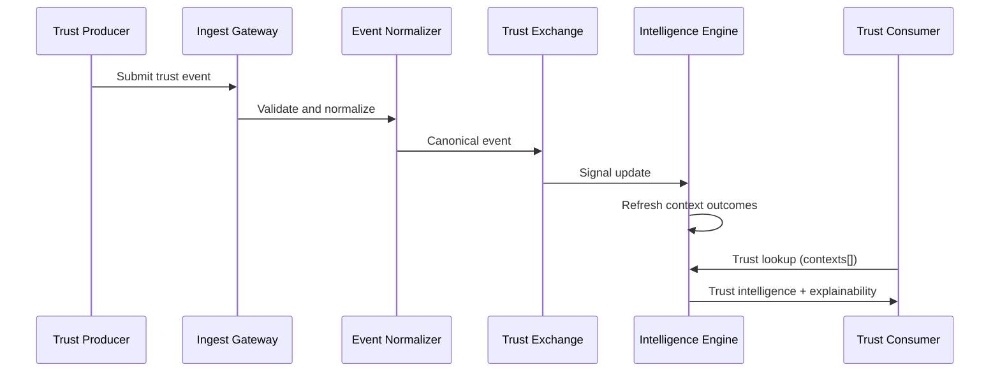

# Architecture Specification

This document defines the normative architecture for Portable Trust Infrastructure (PTI) v1.0.

## Normative language

The key words **MUST**, **MUST NOT**, **REQUIRED**, **SHALL**, **SHALL NOT**, **SHOULD**, **SHOULD NOT**, **RECOMMENDED**, **MAY**, and **OPTIONAL** are to be interpreted as described in [RFC 2119](https://datatracker.ietf.org/doc/html/rfc2119).

## Architectural principles

PTI implementations **MUST** adhere to the following principles:

1. **Separation of production and consumption** — trust signals are generated independently of institutional lookup decisions.
2. **Context isolation** — signals, scores, and lookups **MUST** be scoped to explicit trust contexts.
3. **Provenance by default** — every derived outcome **MUST** retain an auditable evidence chain.
4. **Programmable exchange** — producers and consumers interact through versioned APIs and event schemas.
5. **Subject-centric identity** — a portable identifier (`pti_id`) **MUST** survive partner and context changes.

## Trust planes

PTI defines three logical planes. Physical deployment **MAY** colocate components, but logical boundaries **MUST** be enforced.

### Production plane

The production plane accepts **trust events** from **trust producers**, validates them against catalogued event types, and materializes **trust signals** and **trust evidence**.

| Component | Responsibility |
|-----------|----------------|
| **Ingest Gateway** | Authentication, schema validation, rate control, idempotency |
| **Event Normalizer** | Maps partner payloads to canonical trust events |
| **Signal Materializer** | Derives normalized trust signals with context binding |
| **Evidence Store** | Persists attestations, documents, and verification artifacts |

Producers **MUST NOT** write directly to consumer-facing lookup stores.

### Fabric plane

The fabric plane maintains the **trust graph**, resolves identities, routes assertions, and executes intelligence derivation.

| Component | Responsibility |
|-----------|----------------|
| **Trust Registry** | Subject directory, `pti_id` allocation, entitlement registry |
| **Trust Exchange** | Assertion routing, cross-producer fan-out, policy enforcement |
| **Trust Intelligence Engine** | Context scoring, confidence derivation, explainability |
| **Trust Graph Store** | Relationships, endorsements, and temporal signal history |

The fabric plane **MUST** enforce governance policy before signals influence consumer-visible outcomes.

### Consumption plane

The consumption plane serves **trust consumers** at decision time.

| Component | Responsibility |
|-----------|----------------|
| **Trust Lookup API** | Context-scoped intelligence retrieval |
| **Trust Verification API** | Assertion and report authenticity checks |
| **Policy Gateway** | Entitlement, consent, and data-minimization enforcement |
| **Explainability Renderer** | Structured drivers, coverage gaps, and provenance slices |

Consumers **MUST** receive only fields entitled under the active trust context and lookup tier.

## Core data flow

## Trust context binding

Every event, signal, and lookup **MUST** include a `context_id` referencing a registered trust context. Contexts **MUST** be declared in the registry profile and **MUST NOT** be inferred implicitly from producer identity.

Lens contexts (cross-cutting views) **MAY** be derived from primary contexts according to published derivation rules. Derived contexts **MUST** declare upstream context dependencies.

## Identity resolution

The Trust Registry **MUST**:

- Allocate stable `pti_id` values for portable subjects.
- Maintain partner-local entity identifier mappings.
- Support deterministic and probabilistic resolution with explicit confidence metadata.
- Reject merges that violate governance or consent policy.

Resolution outcomes **MUST** be auditable and **SHOULD** expose match rationale to entitled consumers.

## Deployment topologies

### Federated registry

Multiple registry operators synchronize subject directories through signed exchange messages. This topology **MUST** use the interoperability profile for registry replication.

### Centralized fabric

A single operator hosts registry, exchange, and intelligence services. This topology **SHOULD** still expose logically separate API surfaces for producer, consumer, and admin roles.

### Edge ingest

Producers deploy regional ingest gateways that forward normalized events to a central fabric. Edge gateways **MUST** perform schema validation and **SHOULD** buffer with at-least-once delivery semantics.

## Non-functional requirements

| Requirement | Normative baseline |
|-------------|-------------------|
| **Availability** | Lookup APIs **SHOULD** target 99.9% monthly availability for entitled tiers. |
| **Latency** | Synchronous lookups **SHOULD** complete within 2 seconds at P95 under nominal load. |
| **Durability** | Accepted events **MUST** be durably stored before acknowledgment. |
| **Observability** | All planes **MUST** emit correlation identifiers traceable across ingest and lookup. |
| **Clock sync** | Timestamps **MUST** use UTC with ISO 8601 encoding. |

## Security architecture integration

Cryptographic protections, tenant isolation, and audit logging **MUST** conform to the [Security Specification](./security). Authentication and authorization **MUST** conform to [Authentication Model](./authentication-model) and [Authorization Model](./authorization-model).

## Related documents

- [Reference Data Model](./reference-data-model)
- [Reference Event Model](./reference-event-model)
- [Reference Architecture](../../reference-architecture/)
