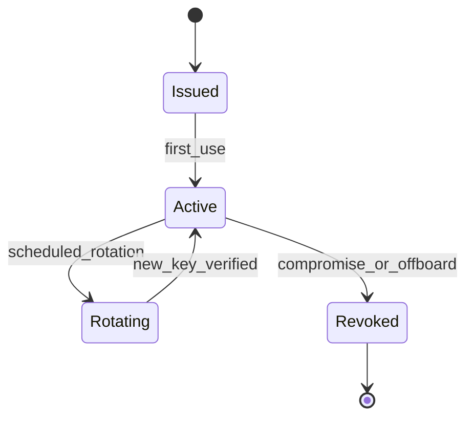

# Authentication Model

This document defines authentication requirements for PTI v1.0 API access.

## Normative language

The key words **MUST**, **MUST NOT**, **REQUIRED**, **SHALL**, **SHALL NOT**, **SHOULD**, **SHOULD NOT**, **RECOMMENDED**, **MAY**, and **OPTIONAL** are to be interpreted as described in [RFC 2119](https://datatracker.ietf.org/doc/html/rfc2119).

## Authentication goals

Every API request **MUST** establish:

1. **Caller identity** — which tenant or service acts.
2. **Credential integrity** — proof the credential is valid and unrevoked.
3. **Freshness** — protection against replay for signed requests.

Anonymous access **MAY** be permitted only on explicitly marked public verification endpoints.

## Credential types

| Type | Use case | Transport |
|------|----------|-----------|
| **API key + secret** | Server-to-server integrations | HMAC-signed requests or OAuth2 client credentials |
| **Bearer access token** | Short-lived session access | `Authorization: Bearer` header |
| **mTLS client certificate** | High-assurance service mesh | TLS handshake |
| **Signed JWT** | Federation and assertion exchange | `Authorization: Bearer` or detached JWS |

Interactive user sessions **SHOULD NOT** be embedded in producer automation; use service credentials instead.

## API key authentication

### HMAC request signing

Clients **MUST** send:

| Header | Description |
|--------|-------------|
| `X-PTI-Key-Id` | Public key identifier |
| `X-PTI-Timestamp` | Unix epoch seconds |
| `X-PTI-Signature` | Base64 HMAC-SHA256 of canonical request |

Canonical string **MUST** concatenate:

```
{method}\n{path}\n{timestamp}\n{sha256(body)}
```

Servers **MUST** reject requests with timestamp skew greater than 300 seconds.

## OAuth 2.0 client credentials

Implementations **SHOULD** support OAuth 2.0 client credentials grant for token-oriented clients.

- Access tokens **MUST** expire within 24 hours (default: 1 hour).
- Refresh tokens **MAY** be issued for confidential clients.
- Token introspection endpoint **SHOULD** be available for resource servers.

## Bearer tokens

Access tokens **MUST** be opaque or JWT with:

| Claim | Requirement |
|-------|-------------|
| `sub` | Service principal or tenant automation identity |
| `tenant_id` | Owning tenant |
| `scope` | Space-delimited scopes per [Authorization Model](./authorization-model) |
| `exp` | Expiration |
| `iat` | Issued at |

Resource servers **MUST** validate `exp`, `tenant_id`, and `scope` on every request.

## mTLS

High-assurance profiles **MAY** require client certificates issued by a registry-trusted CA. Certificate rotation **SHOULD** occur before 30-day expiry.

## JWT assertion authentication

Federation partners **MAY** present signed JWTs for cross-registry calls. Verifiers **MUST**:

- Validate issuer against federation trust store
- Enforce `aud` matches local registry identifier
- Reject `alg: none`

## Credential lifecycle



| Event | Requirement |
|-------|-------------|
| **Issuance** | Bind to tenant and intended profile |
| **Rotation** | Support overlapping valid keys for minimum 24 hours |
| **Revocation** | Propagate to all edge gateways within 15 minutes |
| **Audit** | Log issuance, rotation, revocation with actor |

## Sandbox vs production

- Sandbox credentials **MUST** be cryptographically and logically separated from production.
- Sandbox data **MUST NOT** contain production PII without explicit waiver.
- Clients **MUST** use environment-specific base URLs; servers **SHOULD** reject cross-environment tokens.

## Failure handling

Authentication failures **MUST** return `PTI-401x` codes without revealing whether a tenant exists.

Brute-force protection **MUST** apply per `X-PTI-Key-Id` and source IP.

## Related documents

- [Authorization Model](./authorization-model)
- [Security Specification](./security)
- [Reference API Specification](./reference-api-specification)
