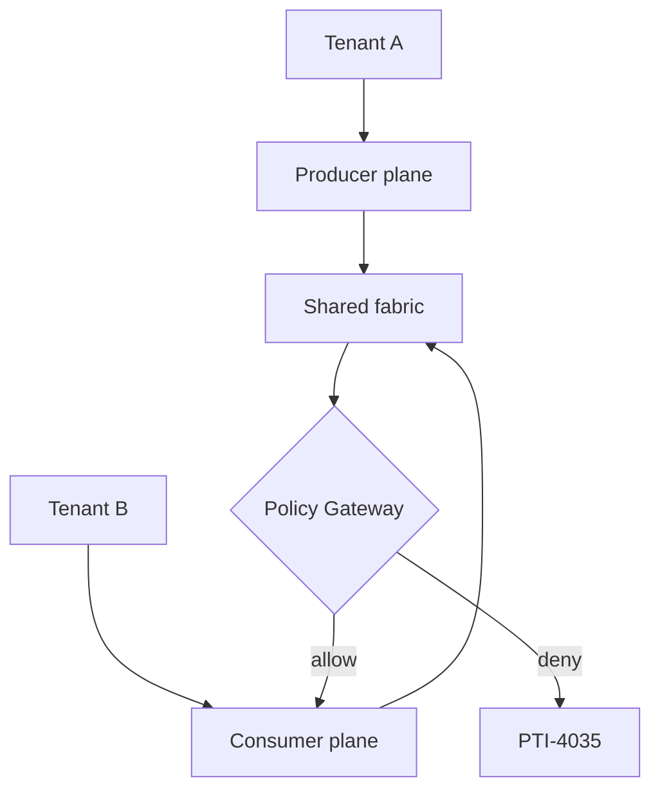

# Authorization Model

This document defines authorization requirements for PTI v1.0 — how authenticated callers receive scoped access across tenants and trust contexts.

## Normative language

The key words **MUST**, **MUST NOT**, **REQUIRED**, **SHALL**, **SHALL NOT**, **SHOULD**, **SHOULD NOT**, **RECOMMENDED**, **MAY**, and **OPTIONAL** are to be interpreted as described in [RFC 2119](https://datatracker.ietf.org/doc/html/rfc2119).

## Authorization principles

1. **Least privilege** — credentials receive minimum scopes for their role.
2. **Explicit entitlements** — context and tier access **MUST** be contract-bound, not implicit.
3. **Tenant isolation** — cross-tenant reads and writes **MUST** be denied by default.
4. **Policy before data** — consent and purpose checks occur before lookup execution.
5. **Deny by default** — unspecified access **MUST** be rejected.

## Roles and base scopes

| Role | Base scopes |
|------|-------------|
| **producer** | `events:write`, `identities:resolve`, `events:read_own` |
| **consumer** | `lookup:search`, `lookup:generate`, `reports:verify` |
| **registry_admin** | `registry:read`, `registry:write`, `catalog:manage` |
| **subject_agent** | `subject:read_self`, `subject:export`, `consent:manage` |

Scopes use `resource:action` namespacing. Implementations **MAY** extend with profile-specific scopes documented in the registry.

## Entitlement objects

Entitlements are registry-managed grants bound to `tenant_id`.

```json
{
  "entitlement_id": "ent_4421",
  "tenant_id": "ten_acme_bank",
  "role": "consumer",
  "contexts": ["lending", "risk_compliance"],
  "lookup_tiers": ["basic", "detailed"],
  "purpose_codes": ["credit_assessment", "collections"],
  "geo_restrictions": ["ZA"],
  "valid_from": "2026-01-01T00:00:00Z",
  "valid_to": "2027-01-01T00:00:00Z"
}
```

### Producer entitlements

Producers **MUST** have entitlements for:

- Each `context_id` they may emit
- Each `event_type` in their catalog binding
- Optional volume tier for rate limits

Emitting outside entitlement **MUST** yield `PTI-4036`.

### Consumer entitlements

Consumers **MUST** have entitlements for:

- Requested `contexts[]` on lookup
- Requested `tier`
- `purpose_code` declared in the lookup request

Mismatch **MUST** yield `PTI-4031` or `PTI-4032`.

## Tenant boundaries



- Data at rest **MUST** include `tenant_id` partition keys.
- Queries **MUST** inject tenant filters from authenticated identity, not from client-supplied body fields.
- Support operators **MAY** break glass with audited impersonation scopes lasting maximum 1 hour.

## Consent and purpose enforcement

When profile requires consent:

1. Policy gateway **MUST** evaluate `consent_token` or live consent registry state.
2. Missing consent **MUST** return `PTI-4033` without partial field leakage.
3. Purpose binding **MUST** match `purpose_code` on the request.

## Subject suppression

Subjects **MAY** hold suppression flags (`lookup_blocked`, `context_blocked:{id}`). Suppression **MUST** override consumer entitlements and return `PTI-4034`.

## Attribute-based access control

Implementations **SHOULD** support ABAC rules for:

| Attribute | Example rule |
|-----------|--------------|
| `geo` | Consumer requests from non-entitled region → deny |
| `time` | Maintenance window restricts mutating calls |
| `risk_score` | Elevated fraud score on API key → throttle |

ABAC denials **MUST** map to `PTI-4030` with internal reason code logged.

## Delegation

Tenants **MAY** delegate limited scopes to subprocessors via delegated credentials. Delegation **MUST**:

- Reference parent `tenant_id`
- Expire within parent entitlement `valid_to`
- Be revocable immediately

## Audit requirements

Authorization denials **MUST** emit audit events with `tenant_id`, requested resource, scope, and rule identifier. Successful lookups **MUST** log `pti_id` reference, contexts, tier, and purpose.

## Related documents

- [Authentication Model](./authentication-model)
- [Governance Specification](./governance)
- [Privacy Specification](./privacy)
- [Reference API Specification](./reference-api-specification)
