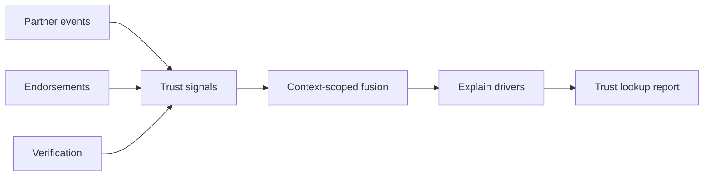

# Trust Explainability Guide

PTI-compatible implementations **MUST** expose explainability so institutions can review outcomes without treating intelligence as a black-box score.

## What consumers receive

Trust lookups **SHOULD** include:

- **Confidence bands** and context-scoped score outcomes
- **Drivers** — ranked factors with human-readable labels
- **Provenance** — partner, community, and verification sources
- **Coverage gaps** — explicit thin-data flags (never implied clearance)

## Explain contract (`explain_score.v1`)

Trust reports and API payloads include explainability suitable for committee review, adverse-action workflows (consumer responsibility), and audit sampling.

Typical structure:

```json
{
  "confidence": {
    "score_pct": 72,
    "band": "good",
    "drivers": [
      {"id": "lending_repayment", "label": "Repayment signals", "weight": 0.32},
      {"id": "community_endorsement", "label": "Community validation", "weight": 0.18}
    ]
  },
  "coverage_gaps": ["thin_insurance_history"]
}
```

Normative detail: [RFC-012 Trust Evidence](/pti/rfcs/rfc-012-trust-evidence)

## Signals → drivers → outcome



## Why two subjects differ

| Factor | Effect |
|--------|--------|
| **Context** | `lending` vs `rental` activate different signal sets |
| **Coverage** | Thin partner linkage → explicit gaps, not silent defaults |
| **Recency** | Recent verified events weigh more than stale silence |
| **Source weights** | Contract-bound producer types per consumer workflow |

## Consumer interfaces

Implementations **MAY** expose explainability through APIs, structured reports, and operator consoles. UI product names are deployment-specific; the **JSON contract** above is what conformance tests validate.

## Reference implementation

[TumiTrust](/pti/reference-implementation/) provides institution-facing explainability panels and API exports aligned with this guide. See [Trust platform overview](/tumitrust/platform/trust-platform-overview) and [Trust platform API](/tumitrust/developer-guides/trust-platform-api).

## Related

- [Trust governance](/pti/specification/v1.0/governance)
- [Risk & compliance](/pti/specification/v1.0/compliance)
- [Why PTI exists](/pti/why-pti/)
