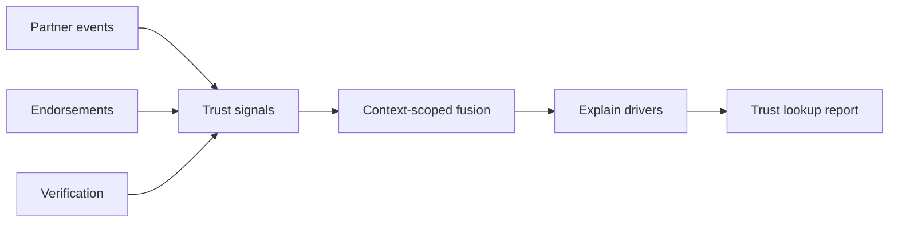

import PdfDownloadBar from '@site/src/components/PdfDownloadBar';

# Trust Explainability Guide

<div class="tt-resource-hero">
  <p class="tt-glossary-kicker">Explainability</p>
  <p class="tt-glossary-lead">Kills the <strong>black-box AI</strong> fear — structured drivers, provenance, and context-scoped slices.</p>
</div>

<PdfDownloadBar title="Trust Explainability Guide" />

## What institutions receive

TumiTrust provides **context-scoped trust intelligence** — not a single opaque "score" sold as a bureau file. Institutions receive:

- **Confidence bands** and score percentages per context
- **Drivers** — ranked factors with human-readable labels
- **Provenance** — partner vs community vs verification sources
- **Coverage gaps** — explicit thin-data flags (never implied clearance)

Additional model governance documentation is available in institution hub **Compliance** and the Resources library.

## Explain contract (`explain_score.v1`)

Trust reports and API JSON include explainability suitable for:

- Committee review
- Adverse-action workflows (institution responsibility)
- Audit sampling

Typical structure:

```json
{
  "confidence": {
    "score_pct": 72,
    "band": "good",
    "drivers": [
      {"id": "lending_repayment", "label": "Repayment signals", "weight": 0.32},
      {"id": "community_endorsement", "label": "Community validation", "weight": 0.18}
    ]
  },
  "coverage_gaps": ["thin_insurance_history"]
}
```

See [Trust platform overview](/tumitrust/platform/trust-platform-overview) and [Trust platform API](/tumitrust/developer-guides/trust-platform-api).

## Signals → drivers → outcome



## Why two people differ

| Factor | Effect |
|--------|--------|
| **Context** | `lending` vs `rental` activate different signal sets |
| **Coverage** | Thin partner linkage → explicit gaps, not silent defaults |
| **Recency** | Recent verified events weigh more than stale silence |
| **Partner weights** | Contract-bound source types per institution workflow |

## Insights Studio (institution hub)

**Explain panel** in Insights Studio mirrors API JSON:

- Score composition chart
- Heatmap across **20 contexts**
- Evidence drill-down to trust events
- Verify link on PDF (tamper-evident portal)

## AI as infrastructure

Machine learning supports **signal fusion and identity resolution** — institutions still receive **structured, inspectable** outcomes.

## Related

- [Trust governance](/pti/specification/v1.0/governance)
- [Risk & compliance](/pti/specification/v1.0/compliance)
- [Why PTI](/pti/introduction/why-pti-exists)
