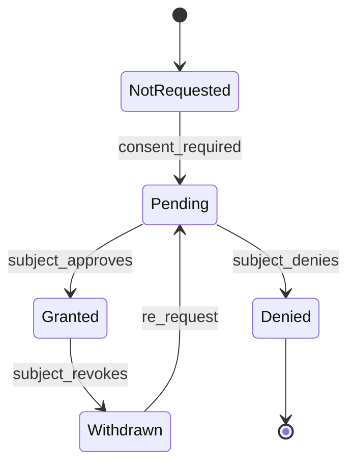

# Governance Specification

This document defines governance requirements for Portable Trust Infrastructure (PTI) v1.0.

## Normative language

The key words **MUST**, **MUST NOT**, **REQUIRED**, **SHALL**, **SHALL NOT**, **SHOULD**, **SHOULD NOT**, **RECOMMENDED**, **MAY**, and **OPTIONAL** are to be interpreted as described in [RFC 2119](https://datatracker.ietf.org/doc/html/rfc2119).

## Governance scope

PTI governance covers how trust data is created, shared, corrected, retained, and retired across producers, consumers, registry operators, and subjects.

## Roles and obligations

### Subject (data principal)

Subjects **MUST** be able to:

- View which contexts hold signals about them.
- Grant, withhold, or withdraw consent for sharing where required by policy.
- Request correction, deletion, and export per [Privacy Specification](./privacy).
- Challenge inaccurate assertions through a documented dispute process.

### Trust producer

Producers **MUST**:

- Emit only event types and contexts covered by contract and registry profile.
- Attribute events to the correct `pti_id` or resolvable partner entity reference.
- Maintain ingest quality metrics and remediate systematic mapping errors.
- Honor suppression and retraction requests propagated from the registry.

Producers **MUST NOT** submit prohibited data categories defined in the registry policy pack (e.g., raw biometrics without explicit profile enablement).

### Trust consumer

Consumers **MUST**:

- Request lookups only for entitled workflows and contexts.
- Document lawful basis for processing where jurisdiction requires it.
- Use explainability artifacts for adverse or negative decisions when outcomes materially affect the subject.
- Refrain from republishing raw trust data outside contractual purpose.

### Registry operator

The registry operator **MUST**:

- Maintain authoritative context and event catalogs.
- Enforce entitlement and consent policy at lookup time.
- Operate auditable data-subject request workflows.
- Publish transparency reports on lookup volume and policy denials where regulation requires.

## Consent model

When `consent_required` is true for a lookup profile:

- The lookup **MUST NOT** return restricted fields until consent state is `granted`.
- Consent grants **MUST** be bound to `consumer_id`, `context_id`, and purpose code.
- Withdrawal **MUST** take effect within the SLA defined in the privacy policy (default: 24 hours).

## Data provenance requirements

Every consumer-visible outcome **MUST** expose provenance sufficient to answer:

1. **Who** attested the underlying evidence?
2. **When** was it recorded?
3. **Which context** does it affect?
4. **What verification** was applied?

Opaque composite scores without provenance **MUST NOT** be labeled as PTI-conformant outcomes.

## Retention and deletion

| Data class | Default retention | Deletion trigger |
|------------|-------------------|------------------|
| Raw events | Contract-defined minimum | Subject erasure, producer retraction, expiry |
| Derived signals | While context active + grace period | Context disablement, erasure |
| Lookup artifacts | Consumer policy + platform minimum | Expiry, erasure request |
| Audit logs | Regulatory minimum | Legal hold exception only |

Erasure **MUST** cascade to derived artifacts unless a legal hold explicitly blocks deletion. Holds **MUST** be time-bounded and audited.

## Dispute resolution

Subjects **MAY** dispute:

- Incorrect identity linkage
- Factually wrong event attributes
- Unauthorized producer assertions

The registry **MUST** provide a ticketed workflow with:

- Acknowledgment within 5 business days
- Producer notification for contested events
- Interim suppression flags where risk of harm is material
- Final determination with appeal path

## Policy packs

Registry operators **MAY** publish policy packs that constrain:

- Allowed event types per context
- Lookup tier field visibility
- Cross-border transfer rules
- Model explainability minimums

Implementations claiming a policy pack **MUST** enforce all pack rules.

## Accountability metrics

Operators **SHOULD** measure and review:

- Consent denial and withdrawal rates
- Dispute volume and time-to-resolution
- Producer validation error rates
- Unauthorized lookup attempt counts

## Federation governance

Federated registries **MUST** execute data-processing agreements covering:

- Identity merge rules
- Conflict resolution for contradictory assertions
- Joint incident notification
- Exit and data portability on federation termination

## Related documents

- [Privacy Specification](./privacy)
- [Security Specification](./security)
- [Authorization Model](./authorization-model)
- [Reference Event Model](./reference-event-model)
