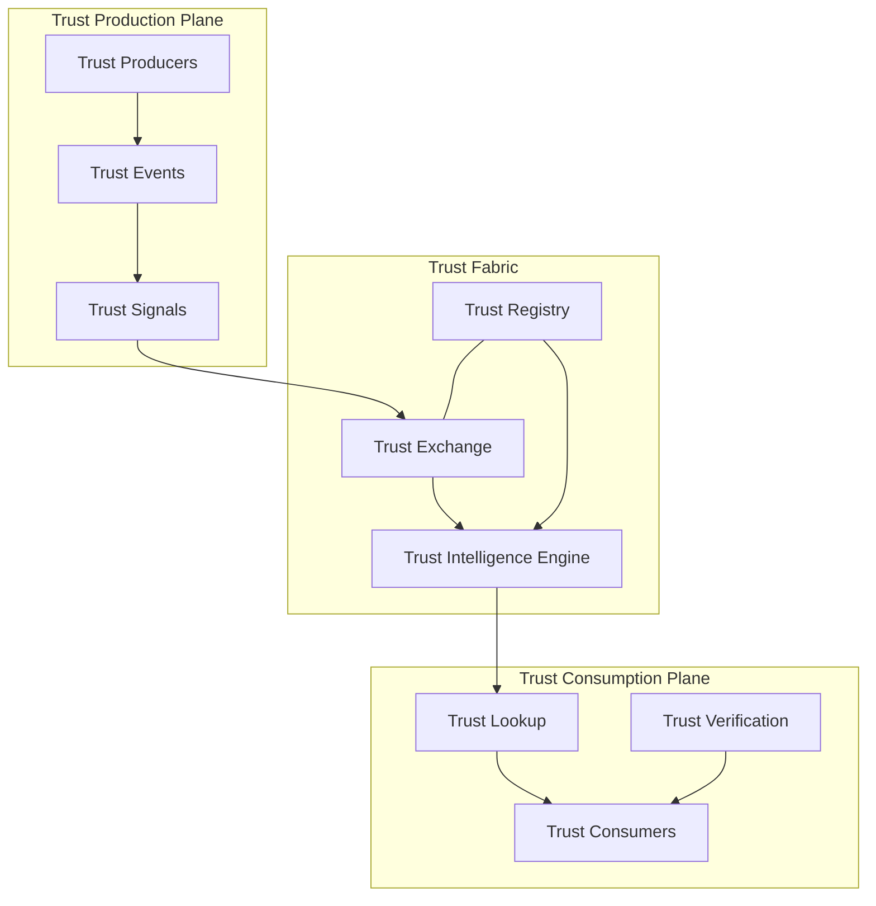

# PTI Specification v1.0

Portable Trust Infrastructure (PTI) v1.0 defines a vendor-neutral architecture for generating, exchanging, resolving, and consuming **trust intelligence** across institutional boundaries. This specification separates trust **production** (signal ingestion and attestation) from trust **consumption** (lookup, verification, and decision support).

## Normative language

The key words **MUST**, **MUST NOT**, **REQUIRED**, **SHALL**, **SHALL NOT**, **SHOULD**, **SHOULD NOT**, **RECOMMENDED**, **MAY**, and **OPTIONAL** in this specification are to be interpreted as described in [RFC 2119](https://datatracker.ietf.org/doc/html/rfc2119).

## Specification goals

PTI v1.0 addresses four interoperability problems:

1. **Fragmentation** — credible activity signals remain locked in single-institution silos.
2. **Opacity** — decision systems lack structured provenance and explainability.
3. **Context collapse** — unrelated life areas are conflated into a single opaque score.
4. **Programmability** — institutions cannot integrate trust outcomes through stable APIs and schemas.

Implementations that conform to this specification **MUST** preserve context isolation, provenance chains, and subject rights while enabling cross-institutional trust exchange.

## Conformance classes

| Class | Description |
|-------|-------------|
| **Trust Producer** | Ingests events, emits signals, and attests evidence within entitled trust contexts. |
| **Trust Consumer** | Requests trust lookups, verifies assertions, and applies policy at decision time. |
| **Trust Registry** | Maintains subject directory, identity resolution, and entitlement metadata. |
| **Trust Exchange** | Routes events and assertions between producers and consumers under governance policy. |
| **Trust Intelligence Engine** | Derives context-scoped outcomes, confidence bands, and explainability artifacts. |

A deployment **MAY** implement one or more classes. Hybrid deployments **MUST** enforce tenant and context boundaries defined in the [Authorization Model](./authorization-model).

## Document catalogue

| Document | Scope |
|----------|-------|
| [Architecture](./architecture) | Normative system architecture, components, and trust planes |
| [Security](./security) | Threat model, controls, cryptography, and audit requirements |
| [Governance](./governance) | Roles, consent, retention, and accountability obligations |
| [Privacy](./privacy) | Data minimization, subject rights, and lawful processing |
| [Interoperability](./interoperability) | Profiles, bindings, and cross-vendor exchange rules |
| [Reference Data Model](./reference-data-model) | Identity, trust context, signal, and assertion objects |
| [Reference Event Model](./reference-event-model) | Trust event schema, lifecycle, and idempotency |
| [Reference API Specification](./reference-api-specification) | Abstract Trust Lookup, Exchange, and Registry APIs |
| [Reference Error Codes](./reference-error-codes) | Standard error taxonomy and handling |
| [Versioning Strategy](./versioning-strategy) | Schema and API version negotiation |
| [Authentication Model](./authentication-model) | Credential types and verification for PTI APIs |
| [Authorization Model](./authorization-model) | Scopes, entitlements, and tenant boundaries |

Non-normative companion material:

- [Reference Architecture](../../reference-architecture/) — conceptual models and diagrams
- [Glossary](../../glossary/) — canonical term definitions
- [Implementation Guide](../../implementation-guide/) — integration patterns and migration
- [Explainability](/pti/specification/v1.0/explainability) — explainability artifact contract
- [Compliance](./compliance) — risk and compliance integration profile

## Architectural overview

## Reading order

1. [Architecture](./architecture) and [Reference Data Model](./reference-data-model) for structural foundations.
2. [Reference Event Model](./reference-event-model) and [Reference API Specification](./reference-api-specification) for integration contracts.
3. [Authentication Model](./authentication-model), [Authorization Model](./authorization-model), and [Security](./security) before production deployment.
4. [Governance](./governance) and [Privacy](./privacy) for policy alignment with regulators and data-protection authorities.

## Version identifier

This document set is identified as **`pti-spec/1.0`**. Implementations **SHOULD** advertise supported specification versions in API metadata and registry profiles.

## Reference implementations

Vendor-specific deployments that implement PTI v1.0 concepts are documented separately. TumiTrust provides a reference trust platform with producer ingest, institutional lookup APIs, and context-scoped intelligence exports. Reference implementations **MUST NOT** be treated as extensions to this normative specification unless explicitly profiled in [Interoperability](./interoperability).
