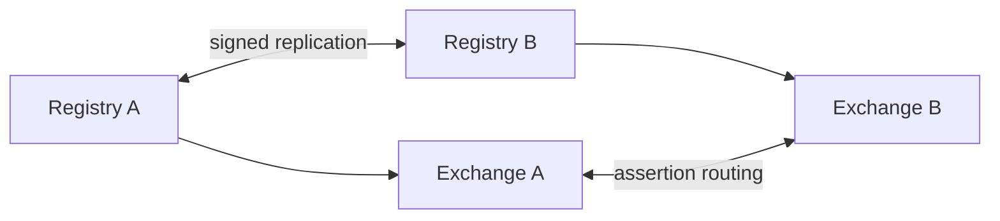

# Interoperability Specification

This document defines how independent PTI v1.0 implementations achieve cross-vendor interoperability.

## Normative language

The key words **MUST**, **MUST NOT**, **REQUIRED**, **SHALL**, **SHALL NOT**, **SHOULD**, **SHOULD NOT**, **RECOMMENDED**, **MAY**, and **OPTIONAL** are to be interpreted as described in [RFC 2119](https://datatracker.ietf.org/doc/html/rfc2119).

## Interoperability goals

Independent implementations **MUST** be able to:

- Exchange canonical trust events without proprietary field translation.
- Resolve `pti_id` references through registry federation or delegated lookup.
- Verify signed trust assertions across operator boundaries.
- Negotiate API and schema versions without silent incompatibility.

## Conformance profiles

A **profile** is a named subset of PTI requirements for a deployment class.

| Profile ID | Audience | Required capabilities |
|------------|----------|----------------------|
| `pti-producer/v1` | Trust producers | Event ingest, idempotency, context binding |
| `pti-consumer/v1` | Trust consumers | Lookup, verification, entitlement checks |
| `pti-registry/v1` | Registry operators | Identity directory, merge policy, catalogs |
| `pti-federation/v1` | Multi-operator fabrics | Signed replication, conflict rules |

Implementations **MUST** publish a machine-readable profile document at a well-known registry endpoint.

## Protocol bindings

The abstract APIs in [Reference API Specification](./reference-api-specification) **MAY** bind to:

| Binding | Transport | Format | Status |
|---------|-----------|--------|--------|
| **HTTP+JSON** | HTTPS | `application/json` | REQUIRED baseline |
| **HTTP+JSON-LD** | HTTPS | Linked data contexts | OPTIONAL |
| **Async queue** | AMQP, Kafka, SQS | Canonical event envelope | RECOMMENDED for high volume |

All bindings **MUST** preserve:

- `correlation_id`
- `schema_version`
- `context_id`
- `idempotency_key`

## Schema negotiation

Clients and servers **MUST** support version negotiation per [Versioning Strategy](./versioning-strategy).

- Servers **MUST** reject unsupported major versions with `PTI-4001`.
- Servers **SHOULD** accept minor version drift when backward compatible.

## Event catalog interoperability

Producers **MUST** map local event types to canonical `event_type` values registered in the shared catalog. Custom event types **MAY** be used within a tenant but **MUST NOT** be promoted to federation without catalog registration.

Canonical event types **MUST** include:

```json
{
  "event_type": "lending.repayment.completed",
  "context_id": "lending",
  "schema_version": "trust_event.v1",
  "payload_schema": "https://schemas.pti.example/trust_event/lending_repayment/v1"
}
```

## Trust assertion exchange

Cross-operator assertion exchange **MUST** use signed envelopes:

| Field | Requirement |
|-------|-------------|
| `assertion_id` | Globally unique UUID |
| `issuer` | Registry-trusted producer URI |
| `subject_pti_id` | Resolved portable identifier |
| `context_id` | Registered context |
| `issued_at` | ISO 8601 UTC |
| `signature` | JWS or COSE per security profile |

Verifiers **MUST** validate signature, expiration, and issuer trust chain before ingesting foreign assertions.

## Registry federation



Federated registries **MUST**:

- Reconcile `pti_id` conflicts using published merge precedence rules.
- Propagate subject suppression and erasure requests.
- Maintain eventual consistency with maximum divergence window declared in SLA (default: 15 minutes).

## Error interoperability

All implementations **MUST** map internal failures to [Reference Error Codes](./reference-error-codes). Custom error namespaces **MUST NOT** replace standard codes for equivalent conditions.

## Conformance testing

Operators **SHOULD** maintain test suites covering:

1. Golden-path event ingest and lookup
2. Idempotent replay
3. Version mismatch handling
4. Authorization denial paths
5. Federation assertion verify/reject

Third-party auditors **MAY** certify profile conformance; certification **MUST NOT** imply regulatory approval.

## Related documents

- [Reference API Specification](./reference-api-specification)
- [Reference Event Model](./reference-event-model)
- [Versioning Strategy](./versioning-strategy)
- [Authentication Model](./authentication-model)
