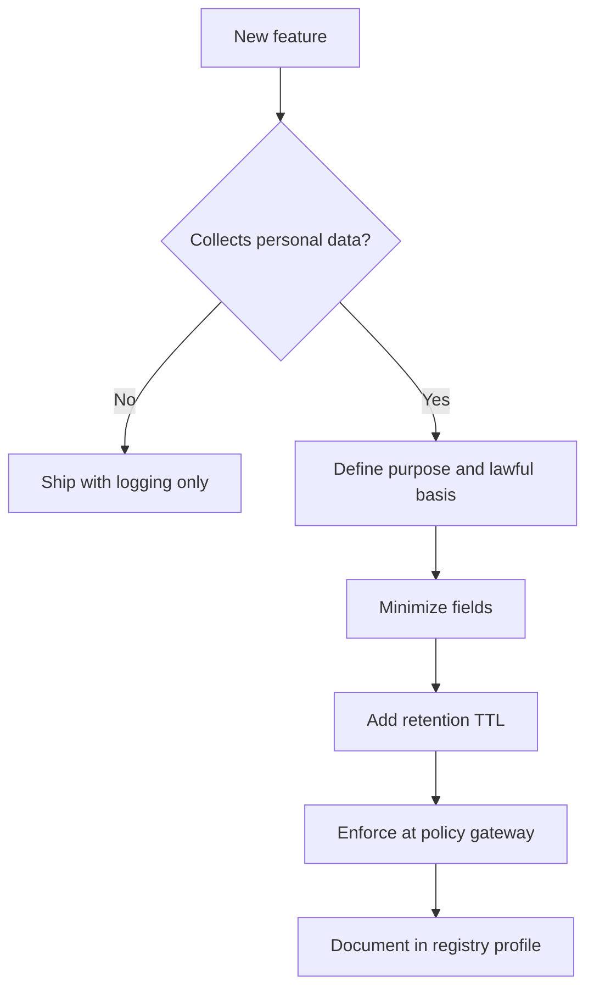

# Privacy Specification

This document defines privacy requirements for Portable Trust Infrastructure (PTI) v1.0.

## Normative language

The key words **MUST**, **MUST NOT**, **REQUIRED**, **SHALL**, **SHALL NOT**, **SHOULD**, **SHOULD NOT**, **RECOMMENDED**, **MAY**, and **OPTIONAL** are to be interpreted as described in [RFC 2119](https://datatracker.ietf.org/doc/html/rfc2119).

## Privacy principles

PTI implementations **MUST** implement:

1. **Purpose limitation** — data collected for trust derivation **MUST NOT** be reused for unrelated purposes without a new lawful basis.
2. **Data minimization** — lookups return only fields required for the entitled tier and context.
3. **Transparency** — subjects **MUST** be informed about contexts, producers, and consumers affecting their trust profile.
4. **Storage limitation** — retention **MUST** follow [Governance Specification](./governance) schedules.
5. **Integrity and confidentiality** — aligned with [Security Specification](./security).

## Lawful processing

Each actor **MUST** document lawful basis for processing personal data under applicable jurisdiction (e.g., consent, contract, legal obligation, legitimate interest).

| Processing activity | Typical lawful basis |
|----------------------|----------------------|
| Event ingest from producer | Contract + subject relationship with producer |
| Identity resolution | Contract + legitimate interest with safeguards |
| Institutional lookup | Consent or contract depending on profile |
| Fraud and abuse prevention | Legitimate interest with proportionality review |

Lookup profiles that return sensitive inferences **MUST** declare additional safeguards in the registry policy pack.

## Data categories

| Category | Examples | Handling |
|----------|----------|----------|
| **Identifiers** | Name, phone, government ID hash | Minimize; hash where possible |
| **Behavioral signals** | Repayment events, rental history | Context-bound; provenance required |
| **Inferred outcomes** | Context scores, confidence bands | Explainability mandatory |
| **Special category references** | Health, biometrics pointers | Profile-gated; explicit enablement required |

Producers **MUST NOT** transmit special-category data unless the interoperability profile explicitly permits it.

## Subject rights

Implementations **MUST** support the following rights workflows:

### Right of access

Subjects **MUST** receive a structured export of:

- Active `pti_id` mappings
- Contexts with non-zero signal presence
- Recent lookup metadata (consumer category, context, timestamp) where law requires

### Right to rectification

Correction requests **MUST** route to the authoritative producer when the contested data originated externally. The registry **MAY** apply interim annotations until resolution.

### Right to erasure

Erasure **MUST**:

- Remove or irreversibly anonymize subject-identifying fields in entitled stores.
- Propagate deletion to derived intelligence within defined SLA (default: 30 days maximum for complete purge, with 24-hour suppression of consumer lookups).
- Preserve minimal audit records only where legal obligation mandates.

### Right to portability

Portability exports **SHOULD** use machine-readable formats (JSON-LD or equivalent) with schema version identifiers.

### Right to object and restrict

Subjects **MAY** object to specific consumer categories or contexts. Restrictions **MUST** be enforced at the policy gateway before lookup execution.

## Lookup minimization matrix

| Lookup tier | Typical fields | Prohibited without profile |
|-------------|----------------|----------------------------|
| **Basic** | Context score band, coverage summary | Full event history |
| **Detailed** | Drivers, top signals, provenance summary | Raw partner payloads |
| **Predictive** | Model features with explainability | Unreviewed special-category inference |
| **Screening** | Sanctions/PEP match metadata | Bulk historical exports |

Consumers **MUST NOT** request tiers above their entitlement.

## Cross-border transfer

When data crosses jurisdiction boundaries:

- Transfer mechanisms **MUST** be documented (SCCs, adequacy, binding corporate rules).
- Registry operators **MUST** enforce geo-fencing on storage and lookup routing where required.
- Subjects **SHOULD** be notified of international recipients in privacy notices.

## Automated decision-making

Where lookups inform decisions with legal or similarly significant effects:

- Explainability artifacts **MUST** be available to the consumer.
- Human review hooks **SHOULD** be available for contested outcomes.
- Solely automated rejection based on PTI outcomes without explainability **MUST NOT** be labeled conformant.

## Privacy by design checklist

## Breach notification

Operators **MUST** notify supervisory authorities and affected subjects per applicable law when a personal data breach poses risk to rights and freedoms. Notification procedures **MUST** link to [Security Specification](./security) incident response.

## Related documents

- [Governance Specification](./governance)
- [Authorization Model](./authorization-model)
- [Reference API Specification](./reference-api-specification)
