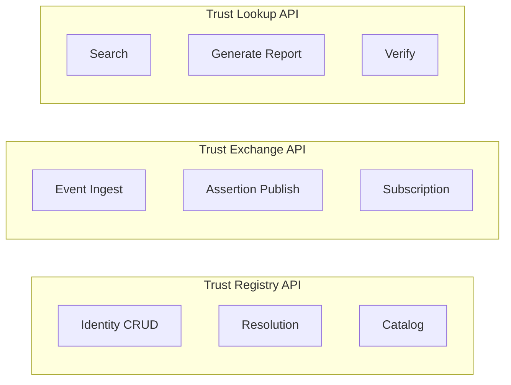

# Reference API Specification

This document defines abstract API contracts for PTI v1.0. Protocol bindings **MUST** preserve semantic equivalence when mapped to HTTP, queues, or other transports.

## Normative language

The key words **MUST**, **MUST NOT**, **REQUIRED**, **SHALL**, **SHALL NOT**, **SHOULD**, **SHOULD NOT**, **RECOMMENDED**, **MAY**, and **OPTIONAL** are to be interpreted as described in [RFC 2119](https://datatracker.ietf.org/doc/html/rfc2119).

## API surfaces

PTI defines three primary service surfaces:



## Common request metadata

All requests **MUST** include:

| Header / field | Requirement |
|----------------|-------------|
| `Authorization` | Bearer token or signed request per [Authentication Model](./authentication-model) |
| `X-PTI-Version` | API version (e.g., `1.0`) |
| `X-Correlation-Id` | UUID for tracing |
| `X-Tenant-Id` | Consumer or producer tenant |

Responses **MUST** echo `X-Correlation-Id`.

## Trust Registry API

### Create or resolve identity

```
POST /registry/v1/identities/resolve
```

**Request:**

```json
{
  "identity_hints": {
    "phone_e164": "+27821234567",
    "national_id_hash": "sha256:abc..."
  },
  "partner_ref": {
    "partner_id": "prt_acme",
    "entity_id": "cust_9912"
  }
}
```

**Response:**

```json
{
  "pti_id": "pti_7f3c9a2b1e",
  "match_confidence": 0.94,
  "match_method": "deterministic_phone",
  "status": "active"
}
```

Resolution **MUST** fail with `PTI-4041` when no match is permitted rather than returning a guessed identity.

### Get identity

```
GET /registry/v1/identities/{pti_id}
```

Entitled callers **MAY** receive `partner_refs` and `verification_level`.

### List trust contexts

```
GET /registry/v1/contexts
```

Returns registered contexts for the tenant profile.

## Trust Exchange API

### Ingest event

```
POST /exchange/v1/events
```

**Request:** Full trust event envelope per [Reference Event Model](./reference-event-model).

**Responses:**

| Code | Meaning |
|------|---------|
| `201` | Accepted and materialized synchronously |
| `202` | Accepted for async processing |
| `400` | Validation failure |
| `409` | Idempotency conflict |

### Publish assertion

```
POST /exchange/v1/assertions
```

Signed trust assertion per [Reference Data Model](./reference-data-model). Server **MUST** verify signature before acceptance.

### Subscribe to events (optional)

```
POST /exchange/v1/subscriptions
```

Webhook consumers **MAY** register for `event.materialized`, `assertion.published`, and `identity.merged` topics.

## Trust Lookup API

### Search subjects

```
POST /lookup/v1/subjects/search
```

**Request:**

```json
{
  "query": {
    "phone_e164": "+27821234567",
    "name": "N. Mokoena"
  },
  "contexts": ["lending"],
  "purpose_code": "credit_assessment"
}
```

Search **MUST** apply data minimization — results return candidate `pti_id` and match confidence, not full profiles.

### Generate trust report

```
POST /lookup/v1/reports/generate
```

**Request:**

```json
{
  "pti_id": "pti_7f3c9a2b1e",
  "contexts": ["lending", "risk_compliance"],
  "tier": "detailed",
  "purpose_code": "credit_assessment",
  "consent_token": "cst_ optional_when_required"
}
```

**Response (excerpt):**

```json
{
  "report_id": "rpt_8d4e2f1a0b",
  "schema_version": "trust_intelligence.v1",
  "generated_at": "2026-07-13T10:00:00Z",
  "contexts": {
    "lending": {
      "score_pct": 72,
      "band": "good",
      "confidence": 0.81,
      "drivers": [
        {"id": "repayment_on_time", "weight": 0.34, "label": "On-time repayments"}
      ],
      "coverage_gaps": []
    }
  },
  "provenance_summary": {
    "producer_count": 3,
    "latest_signal_at": "2026-06-28T09:12:00Z"
  },
  "verify_uri": "https://verify.example/rpt_8d4e2f1a0b"
}
```

Reports **MUST** include `schema_version` and verify URI when tamper-evident delivery is enabled.

### Verify report

```
GET /lookup/v1/reports/{report_id}/verify
```

Public or authenticated verification **MUST** confirm report integrity and expiration without exposing unauthorized fields.

## Pagination and filtering

List endpoints **SHOULD** support cursor pagination:

```json
{
  "data": [],
  "next_cursor": "eyJpZCI6MTIzfQ",
  "has_more": true
}
```

## Rate limits

Implementations **MUST** return `429` with `Retry-After` when limits are exceeded. Standard error body **MUST** use [Reference Error Codes](./reference-error-codes).

## Webhooks

Outbound webhooks **MUST**:

- Sign payloads with HMAC-SHA256 or JWS
- Include `delivery_id` for idempotent receiver handling
- Retry with exponential backoff for up to 72 hours

## Related documents

- [Authentication Model](./authentication-model)
- [Authorization Model](./authorization-model)
- [Reference Error Codes](./reference-error-codes)
- [Versioning Strategy](./versioning-strategy)
