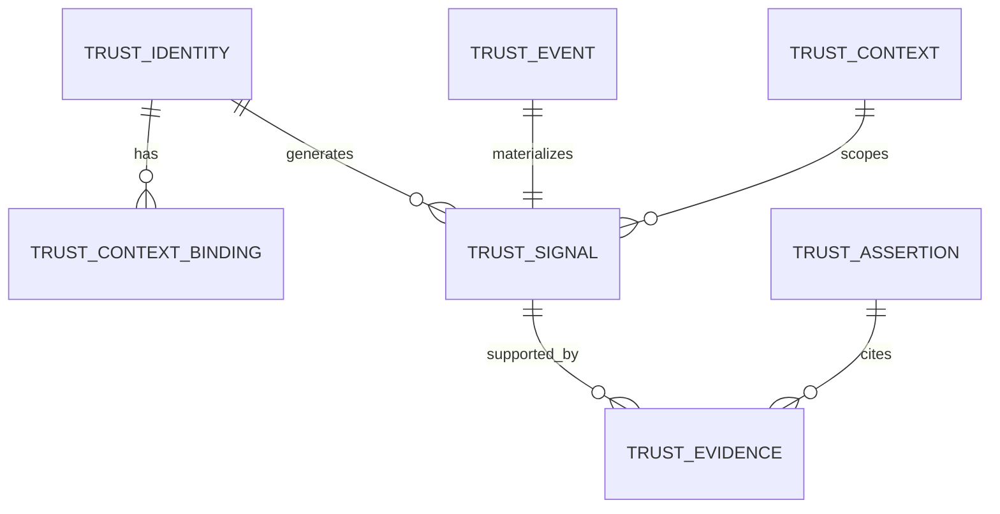

# Reference Data Model

This document defines canonical data objects for Portable Trust Infrastructure (PTI) v1.0.

## Normative language

The key words **MUST**, **MUST NOT**, **REQUIRED**, **SHALL**, **SHALL NOT**, **SHOULD**, **SHOULD NOT**, **RECOMMENDED**, **MAY**, and **OPTIONAL** are to be interpreted as described in [RFC 2119](https://datatracker.ietf.org/doc/html/rfc2119).

## Object overview



## Trust Identity

Represents a portable subject in the trust fabric.

| Field | Type | Required | Description |
|-------|------|----------|-------------|
| `pti_id` | string | **MUST** | Stable portable identifier (`pti_` prefix + opaque suffix) |
| `identity_type` | enum | **MUST** | `individual`, `organization`, `device_proxy` |
| `status` | enum | **MUST** | `active`, `suspended`, `merged`, `erased` |
| `created_at` | datetime | **MUST** | ISO 8601 UTC |
| `partner_refs` | array | OPTIONAL | Partner-local entity mappings |
| `verification_level` | enum | SHOULD | `unverified`, `document`, `registry`, `in_person` |

### Partner reference object

```json
{
  "partner_id": "prt_acme_lending",
  "entity_id": "borrower_88421",
  "linked_at": "2026-01-15T10:22:00Z"
}
```

`pti_id` values **MUST NOT** embed personally identifiable information.

## Trust Context

Defines a life-area or lens scope for signals and lookups.

| Field | Type | Required | Description |
|-------|------|----------|-------------|
| `context_id` | string | **MUST** | Stable slug (e.g., `lending`, `risk_compliance`) |
| `context_tier` | enum | **MUST** | `primary`, `lens` |
| `label` | string | **MUST** | Human-readable name |
| `derivation_rules` | array | OPTIONAL | Upstream contexts for lens derivation |
| `enabled` | boolean | **MUST** | Registry publication flag |

Lens contexts **MUST** declare `derivation_rules` when `context_tier` is `lens`.

## Trust Event

See [Reference Event Model](./reference-event-model) for full lifecycle. Summary fields:

| Field | Type | Required |
|-------|------|----------|
| `event_id` | UUID | **MUST** |
| `event_type` | string | **MUST** |
| `context_id` | string | **MUST** |
| `pti_id` | string | **MUST** |
| `producer_id` | string | **MUST** |
| `occurred_at` | datetime | **MUST** |
| `payload` | object | **MUST** |
| `schema_version` | string | **MUST** |

## Trust Signal

Normalized, queryable representation derived from events.

| Field | Type | Required | Description |
|-------|------|----------|-------------|
| `signal_id` | UUID | **MUST** | Unique signal identifier |
| `pti_id` | string | **MUST** | Subject reference |
| `context_id` | string | **MUST** | Bound context |
| `signal_type` | string | **MUST** | Catalogued signal classification |
| `polarity` | enum | **MUST** | `positive`, `negative`, `neutral` |
| `weight` | number | SHOULD | Normalized influence weight (0.0–1.0) |
| `source_event_id` | UUID | **MUST** | Provenance link |
| `effective_at` | datetime | **MUST** | Signal validity start |
| `expires_at` | datetime | OPTIONAL | TTL for ephemeral signals |

Signals **MUST NOT** exist without a `source_event_id` except for governed manual attestations recorded as events.

## Trust Evidence

Supporting material for assertions and verification.

| Field | Type | Required | Description |
|-------|------|----------|-------------|
| `evidence_id` | UUID | **MUST** | Unique evidence identifier |
| `evidence_type` | enum | **MUST** | `document`, `endorsement`, `registry_match`, `badge`, `third_party_report` |
| `uri` | string | OPTIONAL | Secure reference to artifact |
| `hash` | string | SHOULD | Content digest for integrity |
| `attestor_id` | string | **MUST** | Producer or verifier identity |
| `attested_at` | datetime | **MUST** | Attestation timestamp |

Evidence URIs **MUST** use HTTPS or governed internal schemes.

## Trust Assertion

A signed statement about a subject in a context.

| Field | Type | Required | Description |
|-------|------|----------|-------------|
| `assertion_id` | UUID | **MUST** | Globally unique |
| `pti_id` | string | **MUST** | Subject |
| `context_id` | string | **MUST** | Context scope |
| `claim` | object | **MUST** | Machine-readable claim body |
| `confidence` | number | SHOULD | 0.0–1.0 attestor confidence |
| `evidence_ids` | array | SHOULD | Supporting evidence |
| `issuer_id` | string | **MUST** | Signing producer or registry |
| `issued_at` | datetime | **MUST** | Issue time |
| `expires_at` | datetime | OPTIONAL | Assertion TTL |
| `signature` | string | **MUST** | JWS compact serialization |

## Context Score (derived object)

Output of the Trust Intelligence Engine; not directly writable by producers.

| Field | Type | Required | Description |
|-------|------|----------|-------------|
| `pti_id` | string | **MUST** | Subject |
| `context_id` | string | **MUST** | Context |
| `score_pct` | integer | **MUST** | 0–100 normalized outcome |
| `band` | enum | **MUST** | `thin`, `fair`, `good`, `strong` |
| `confidence` | number | **MUST** | Model confidence 0.0–1.0 |
| `computed_at` | datetime | **MUST** | Last refresh timestamp |
| `coverage_gaps` | array | SHOULD | Explicit thin-data flags |

## Validation rules

1. All objects **MUST** include `schema_version`.
2. `context_id` on events, signals, and assertions **MUST** match registry-published contexts.
3. Erased subjects (`status: erased`) **MUST NOT** appear in consumer lookups.
4. Merged identities **MUST** redirect lookups to the surviving `pti_id` with `301` semantic in registry APIs.

## Related documents

- [Reference Event Model](./reference-event-model)
- [Reference API Specification](./reference-api-specification)
- [Architecture Specification](./architecture)
