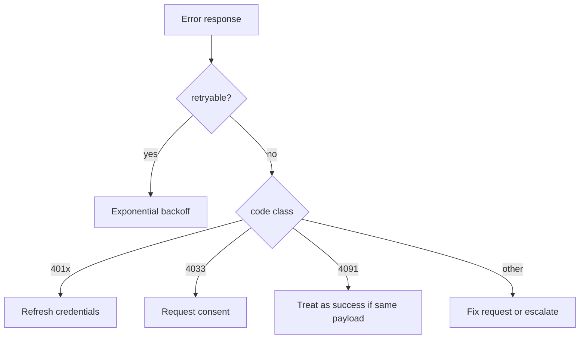

# Reference Error Codes

This document defines the standard error code taxonomy for PTI v1.0 implementations.

## Normative language

The key words **MUST**, **MUST NOT**, **REQUIRED**, **SHALL**, **SHALL NOT**, **SHOULD**, **SHOULD NOT**, **RECOMMENDED**, **MAY**, and **OPTIONAL** are to be interpreted as described in [RFC 2119](https://datatracker.ietf.org/doc/html/rfc2119).

## Error response envelope

All error responses **MUST** use:

```json
{
  "error": {
    "code": "PTI-4001",
    "message": "Unsupported schema version",
    "detail": "trust_event.v2 is not enabled for this tenant",
    "correlation_id": "req_9a8b7c6d",
    "retryable": false,
    "docs_uri": "https://docs.example/pti/errors/PTI-4001"
  }
}
```

| Field | Requirement |
|-------|-------------|
| `code` | **MUST** — stable machine identifier |
| `message` | **MUST** — short human-readable summary |
| `detail` | SHOULD — operator-safe elaboration |
| `correlation_id` | **MUST** — matches request |
| `retryable` | **MUST** — boolean hint for clients |
| `docs_uri` | OPTIONAL — documentation link |

Implementations **MUST NOT** expose stack traces or internal hostnames in production error bodies.

## HTTP status mapping

| HTTP | Usage |
|------|-------|
| `400` | Client payload or parameter errors (`PTI-400x`) |
| `401` | Authentication failure (`PTI-401x`) |
| `403` | Authorization or policy denial (`PTI-403x`) |
| `404` | Resource or subject not found (`PTI-404x`) |
| `409` | Conflict / idempotency (`PTI-409x`) |
| `422` | Semantic validation (`PTI-422x`) |
| `429` | Rate limit (`PTI-4290`) |
| `500` | Internal error (`PTI-500x`) |
| `503` | Temporary unavailability (`PTI-503x`) |

## Validation errors (`PTI-400x`)

| Code | Message | Retryable |
|------|---------|-----------|
| `PTI-4001` | Unsupported schema version | No |
| `PTI-4002` | Unknown event type | No |
| `PTI-4003` | Invalid timestamp | No |
| `PTI-4004` | Missing required field | No |
| `PTI-4005` | Invalid context_id | No |
| `PTI-4006` | Payload schema validation failed | No |
| `PTI-4007` | Invalid pti_id format | No |

## Authentication errors (`PTI-401x`)

| Code | Message | Retryable |
|------|---------|-----------|
| `PTI-4010` | Missing credentials | No |
| `PTI-4011` | Invalid or expired token | No |
| `PTI-4012` | Invalid signature | No |
| `PTI-4013` | Credential revoked | No |

## Authorization errors (`PTI-403x`)

| Code | Message | Retryable |
|------|---------|-----------|
| `PTI-4030` | Insufficient scope | No |
| `PTI-4031` | Context not entitled | No |
| `PTI-4032` | Lookup tier not entitled | No |
| `PTI-4033` | Consent required | No |
| `PTI-4034` | Subject suppressed | No |
| `PTI-4035` | Cross-tenant access denied | No |
| `PTI-4036` | Producer not enabled for context | No |

## Not found errors (`PTI-404x`)

| Code | Message | Retryable |
|------|---------|-----------|
| `PTI-4040` | Resource not found | No |
| `PTI-4041` | Subject not resolved | No |
| `PTI-4042` | Report not found or expired | No |
| `PTI-4043` | Event not found | No |

## Conflict errors (`PTI-409x`)

| Code | Message | Retryable |
|------|---------|-----------|
| `PTI-4090` | Identity merge conflict | No |
| `PTI-4091` | Idempotency key conflict | No |
| `PTI-4092` | Concurrent modification | Yes |

## Semantic errors (`PTI-422x`)

| Code | Message | Retryable |
|------|---------|-----------|
| `PTI-4220` | Event context binding mismatch | No |
| `PTI-4221` | Retraction target not materialized | No |
| `PTI-4222` | Assertion signature invalid | No |
| `PTI-4223` | Policy pack violation | No |

## Rate limiting (`PTI-429x`)

| Code | Message | Retryable |
|------|---------|-----------|
| `PTI-4290` | Rate limit exceeded | Yes |

Clients **SHOULD** honor `Retry-After` headers when present.

## Server errors (`PTI-500x`)

| Code | Message | Retryable |
|------|---------|-----------|
| `PTI-5000` | Internal error | Yes |
| `PTI-5001` | Downstream registry unavailable | Yes |
| `PTI-5002` | Intelligence engine timeout | Yes |

## Service unavailable (`PTI-503x`)

| Code | Message | Retryable |
|------|---------|-----------|
| `PTI-5030` | Maintenance mode | Yes |
| `PTI-5031` | Overloaded | Yes |

## Client handling guidance



- Clients **MUST** log `correlation_id` for support escalation.
- Producers **SHOULD** persist `PTI-4091` conflicts for manual reconciliation.
- Consumers **MUST NOT** retry `403x` errors without entitlement change.

## Extension rules

Implementations **MAY** define vendor-specific codes only above `PTI-9000`. Codes below `PTI-9000` are reserved by the PTI specification.

## Related documents

- [Reference API Specification](./reference-api-specification)
- [Reference Event Model](./reference-event-model)
- [Interoperability Specification](./interoperability)
