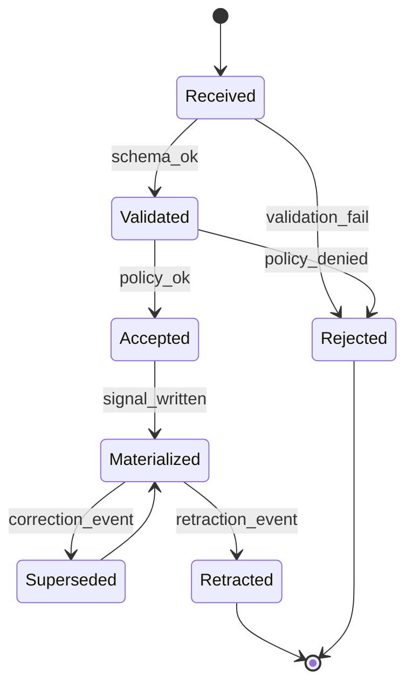

# Reference Event Model

This document defines the canonical trust event schema and lifecycle for PTI v1.0.

## Normative language

The key words **MUST**, **MUST NOT**, **REQUIRED**, **SHALL**, **SHALL NOT**, **SHOULD**, **SHOULD NOT**, **RECOMMENDED**, **MAY**, and **OPTIONAL** are to be interpreted as described in [RFC 2119](https://datatracker.ietf.org/doc/html/rfc2119).

## Event envelope

All trust events **MUST** conform to the envelope below regardless of ingest channel (API, webhook, batch file, connector).

```json
{
  "schema_version": "trust_event.v1",
  "event_id": "550e8400-e29b-41d4-a716-446655440000",
  "idempotency_key": "acme:loan_payoff:88421:2026-03-01",
  "event_type": "lending.repayment.completed",
  "context_id": "lending",
  "pti_id": "pti_7f3c9a2b1e",
  "producer_id": "prt_acme_lending",
  "occurred_at": "2026-03-01T14:30:00Z",
  "ingested_at": "2026-03-01T14:30:05Z",
  "ingest_channel": "api",
  "correlation_id": "req_9a8b7c6d",
  "payload": {
    "loan_id": "LN-88421",
    "amount_minor": 150000,
    "currency": "ZAR",
    "installment_number": 12,
    "status": "on_time"
  }
}
```

### Required envelope fields

| Field | Requirement |
|-------|-------------|
| `schema_version` | **MUST** be `trust_event.v1` for this specification |
| `event_id` | **MUST** be a UUID; server **MAY** accept client-supplied values |
| `idempotency_key` | **MUST** be unique per producer per logical business action |
| `event_type` | **MUST** be registered in the event catalog |
| `context_id` | **MUST** match `event_type` context binding |
| `pti_id` | **MUST** reference an active or resolvable subject |
| `producer_id` | **MUST** match authenticated producer |
| `occurred_at` | **MUST** reflect real-world activity time, not ingest time |
| `payload` | **MUST** validate against type-specific schema |

## Event lifecycle



| State | Description |
|-------|-------------|
| `received` | Persisted ingest record awaiting validation |
| `validated` | Schema and context checks passed |
| `accepted` | Governance policy approved |
| `materialized` | Trust signals derived and graph updated |
| `superseded` | Replaced by correction with forward link |
| `retracted` | Producer or registry withdrew the event |
| `rejected` | Terminal failure with error code |

Consumers **MUST NOT** see outcomes from `rejected` or `retracted` events unless audit profile explicitly permits historical disclosure.

## Idempotency

- Producers **MUST** supply `idempotency_key` for all mutating ingest calls.
- Servers **MUST** return the original `event_id` and status for duplicate keys within the retention window (minimum 30 days).
- Payload hash mismatch on duplicate key **MUST** yield `PTI-4091` conflict.

## Event types and naming

Event types **MUST** use dot-separated namespaces:

```
{context}.{domain}.{action}
```

Examples:

| event_type | context_id |
|------------|------------|
| `lending.repayment.completed` | `lending` |
| `rental.lease.violation` | `rental` |
| `employment.tenure.verified` | `employment` |
| `merchant.chargeback.opened` | `merchant` |

## Correction and retraction

### Correction event

Corrections **MUST** use `event_type` suffix `.corrected` and include:

```json
{
  "corrects_event_id": "550e8400-e29b-41d4-a716-446655440000",
  "reason_code": "data_entry_error",
  "payload": { }
}
```

The original event transitions to `superseded`. Intelligence engines **MUST** recompute affected context scores.

### Retraction event

Retractions **MUST** use `event_type` suffix `.retracted` and include `retracts_event_id`. Retracted signals **MUST** be excluded from new lookups within SLA (default: 1 hour).

## Temporal semantics

- `occurred_at` **MUST** not be more than 10 years in the past unless backfill profile is enabled.
- Future-dated `occurred_at` beyond 24 hours **MUST** be rejected with `PTI-4003`.
- Signal decay functions **MAY** use `occurred_at` as the primary time anchor.

## Batch ingest

Batch files **MUST**:

- Declare `batch_id` and `record_count` in header metadata.
- Process records independently; one failure **MUST NOT** roll back unrelated accepted records.
- Return per-record status in the batch response document.

## Async processing

After HTTP `202 Accepted`, implementations **MUST** expose processing status via:

- Webhook callback `event.materialized` or `event.rejected`
- Polling endpoint `GET /events/{event_id}`

## Observability

Every lifecycle transition **MUST** emit a structured log entry containing `event_id`, `correlation_id`, `producer_id`, and new state.

## Related documents

- [Reference Data Model](./reference-data-model)
- [Reference Error Codes](./reference-error-codes)
- [Reference API Specification](./reference-api-specification)
