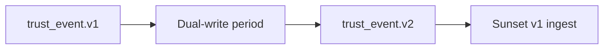

# Versioning Strategy

This document defines versioning rules for PTI v1.0 APIs, events, and derived artifacts.

## Normative language

The key words **MUST**, **MUST NOT**, **REQUIRED**, **SHALL**, **SHALL NOT**, **SHOULD**, **SHOULD NOT**, **RECOMMENDED**, **MAY**, and **OPTIONAL** are to be interpreted as described in [RFC 2119](https://datatracker.ietf.org/doc/html/rfc2119).

## Version identifiers

PTI uses semantic versioning at two layers:

| Layer | Format | Example |
|-------|--------|---------|
| **Specification** | `pti-spec/Major` | `pti-spec/1.0` |
| **Artifact schema** | `name.vMajor` | `trust_event.v1`, `trust_intelligence.v1` |
| **HTTP API** | `Major.Minor` in `X-PTI-Version` | `1.0`, `1.1` |

Major version increments indicate breaking changes. Minor API versions **MUST** remain backward compatible for existing clients.

## Schema compatibility rules

### Backward compatible (minor) changes

The following **MAY** occur without a major bump:

- Adding OPTIONAL fields
- Adding new `event_type` values
- Adding new enum values when clients ignore unknown values
- Adding new error codes

### Breaking (major) changes

The following **MUST** trigger a major version:

- Removing or renaming required fields
- Changing field types or semantics
- Tightening validation previously accepted
- Removing enum values
- Changing signature algorithms without dual support window

## API negotiation

Clients **MUST** send:

```
X-PTI-Version: 1.0
```

Servers **MUST**:

1. Process requests at the highest mutually supported minor version.
2. Reject unsupported major versions with `PTI-4001`.
3. Include `X-PTI-Version` in responses indicating the version used.

### Capability discovery

```
GET /registry/v1/capabilities
```

**Response:**

```json
{
  "spec_version": "pti-spec/1.0",
  "api_versions": ["1.0", "1.1"],
  "schemas": {
    "trust_event": ["v1"],
    "trust_intelligence": ["v1"]
  },
  "deprecated": []
}
```

## Event schema evolution

Producers **MUST** declare `schema_version` on every event. Consumers of async streams **MUST** branch on `schema_version` before deserialization.

Migration pattern for new major event versions:



Dual-write periods **SHOULD** last at least 90 days for federation partners.

## Intelligence artifact versioning

Trust reports **MUST** include `schema_version`. Lookup clients **MUST** validate version before parsing `contexts` blocks.

Adding explainability fields is backward compatible. Removing `drivers` **MUST NOT** occur without major bump.

## Deprecation policy

| Stage | Minimum duration | Operator obligation |
|-------|------------------|---------------------|
| **Announced** | 90 days | Publish deprecation notice in capabilities endpoint |
| **Warning** | 60 days | Log warnings for deprecated clients |
| **Retired** | — | Return `PTI-4001` or `410 Gone` for retired endpoints |

Emergency security retirements **MAY** shorten timelines with 14-day minimum notice except for active exploitation.

## Federation version alignment

Federated registries **MUST** agree on:

- Minimum supported event schema
- Assertion signature suite
- Replication protocol version

Version mismatch **MUST** trigger federation health alert and **SHOULD** block new assertion exchange until resolved.

## Client implementation checklist

1. Pin `X-PTI-Version` explicitly — do not rely on server default.
2. Parse unknown JSON fields gracefully.
3. Monitor `deprecated` array in capabilities responses.
4. Maintain integration tests against staging `next` version channel when offered.

## Related documents

- [Reference API Specification](./reference-api-specification)
- [Reference Event Model](./reference-event-model)
- [Interoperability Specification](./interoperability)
