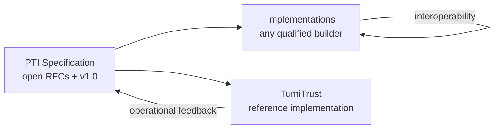

import SpecHero from '@site/src/components/SpecHero';

<SpecHero
  kicker="Specification vs implementation"
  title="PTI and TumiTrust"
  lead="Portable Trust Infrastructure is an open architecture and specification. TumiTrust pioneered the category and operates the first production reference implementation."
  badges={[
    {label: 'Open specification', variant: 'normative'},
    {label: 'Reference implementation', variant: 'default'},
  ]}
/>

## Portable Trust Infrastructure (PTI)

PTI is an **open technical specification** and architectural model. It defines how trust systems can become:

- **Portable** — signals travel with subjects across institutions
- **Programmable** — APIs and events integrate into automated workflows
- **Contextual** — lending, employment, rental, and other life areas stay isolated
- **Explainable** — outcomes trace to evidence and provenance
- **Interoperable** — independent implementations exchange trust via shared semantics

PTI specifies concepts, terminology, architecture, protocols, data models, governance, and conformance — without requiring any single vendor stack.

| PTI defines | Examples |
|-------------|----------|
| Concepts & terminology | Trust context, trust event, `pti_id`, trust lookup |
| Architecture | Producers, exchange, graph, intelligence engine, consumers |
| Protocols & APIs | Event ingest, lookup tiers, federation (RFCs) |
| Governance | Consent, retention, RFC process, conformance profiles |

**Start here:** [Specification v1.0](/pti/specification/v1.0/) · [RFC index](/pti/rfcs/) · [Glossary](/pti/glossary/)

## TumiTrust

**TumiTrust** is the organization that **pioneered** Portable Trust Infrastructure and the **first commercial reference implementation** demonstrating PTI in production.

TumiTrust:

- **Initiated** the PTI conceptual model and initial terminology
- **Authored** the first specification bundle and RFC set
- **Maintains** early stewardship of the public specification through the RFC process
- **Operates** a production platform used by institutions and partners
- **Contributes** operational learnings back into the open standard

TumiTrust is the **founding steward**, not the owner of PTI. Conformance is measured against public RFCs and tests — not vendor affiliation.

| TumiTrust provides | Documentation |
|--------------------|---------------|
| Production PTI implementation | [TumiTrust Platform overview](/tumitrust/platform/trust-platform-overview) |
| Trust platform API | [Developer guides](/tumitrust/developer-guides/trust-platform-api) |
| Operational experience | Feeds RFC and specification revisions |

**Product docs:** [TumiTrust documentation](/tumitrust/product-overview/)

## How they relate

| Question | Answer |
|----------|--------|
| Can I implement PTI without TumiTrust? | **Yes** — see [Build Your Own PTI](/pti/build-your-pti/) |
| Is TumiTrust required for certification? | **No** — [Conformance](/pti/conformance/) is specification-based |
| Who changes the spec? | [Working Group](/pti/governance/working-group) via [RFC process](/pti/governance/rfc-process) |
| Where do I contribute? | [GitHub](https://github.com/tumitrust/pti-specification) · [Contributing](/pti/contributing/) |

## Language to use

| Prefer | Avoid |
|--------|-------|
| TumiTrust **pioneered** PTI | TumiTrust **owns** PTI |
| **Founding steward** | **Exclusive** platform |
| **Reference implementation** | **The** PTI platform |
| **PTI-compatible** (with profile) | **Official** PTI (without certification) |

## Related

- [Specification vs implementation (governance)](/pti/governance/specification-vs-implementation)
- [Reference implementation](/pti/reference-implementation/)
- [PTI Origin](/pti/origin/)
- [Why PTI exists](/pti/why-pti/)
