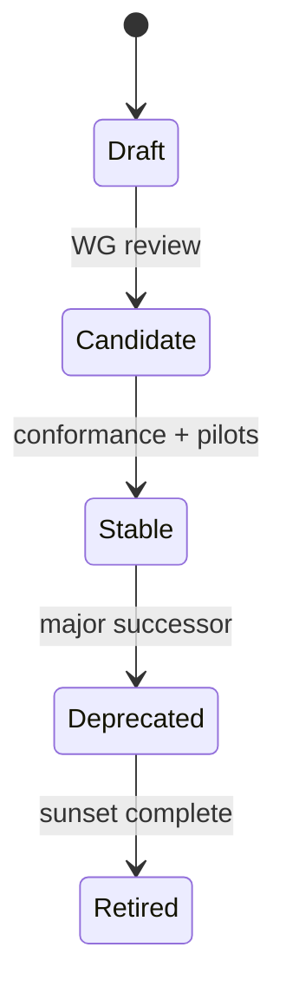

import SpecHero from '@site/src/components/SpecHero';
import PtiVersionBadge from '@site/src/components/PtiVersionBadge';

<SpecHero
  kicker="Specification lifecycle"
  title="PTI Versioning Model"
  lead="How specification releases advance from draft text to stable normative requirements — and how implementations declare compatibility."
  badges={[
    {label: 'Lifecycle', variant: 'normative'},
    {label: 'RFC-010', variant: 'default'},
  ]}
/>

  <PtiVersionBadge linkToSpec />

## Specification release states

| State | Meaning | Breaking changes |
|-------|---------|------------------|
| **Draft** | Early text; community review in progress | Permitted |
| **Candidate** | Feature-complete for pilot implementations | Only with Working Group approval |
| **Stable** | Normative for production compatibility claims | Via major version + [breaking changes policy](/pti/governance/breaking-changes-policy) |
| **Deprecated** | Superseded; migration period active | Frozen except errata |
| **Retired** | Removed from active conformance testing | N/A |

RFCs follow a parallel lifecycle: **Draft → Proposed → Final → Deprecated**. See [RFC process](/pti/governance/rfc-process).

## Current release

| | |
|---|---|
| **Specification** | PTI Specification v1.0 |
| **Status** | **Stable** |
| **Normative bundle** | [Specification v1.0](/pti/specification/v1.0/) |
| **Modular RFCs** | [RFC index](/pti/rfcs/) (Proposed as of v1.0) |

Implementations **SHOULD** declare compatibility as **profile + specification major version** (e.g., *PTI Core Certified, v1.0*).

## Version identifiers

PTI uses semantic versioning at multiple layers:

| Layer | Format | Example |
|-------|--------|---------|
| **Specification** | `pti-spec/Major.Minor` | `pti-spec/1.0` |
| **Artifact schema** | `name.vMajor` | `trust_event.v1` |
| **HTTP API** | `Major.Minor` in `X-PTI-Version` | `1.0` |

Detail: [Versioning strategy (v1.0)](/pti/specification/v1.0/versioning-strategy) · [RFC-010 Versioning](/pti/rfcs/rfc-010-versioning)

## Evolution path

| Milestone | Typical trigger |
|-----------|-----------------|
| Draft → Candidate | RFC set complete; initial test suite |
| Candidate → Stable | Multiple implementations; security review |
| Stable → Deprecated | v2.0 announced with migration window |

Roadmap: [Ecosystem roadmap](/pti/governance/ecosystem-roadmap) · [Specification lifecycle](/pti/governance/specification-lifecycle)

## Contributing to the next version

- Propose changes via [RFCs](/pti/rfcs/) on [GitHub](https://github.com/tumitrust/pti-specification)
- Include backward-compatibility analysis per RFC-010
- Participate in [Working Group](/pti/governance/working-group) review

## Related

- [Version management (governance)](/pti/governance/version-management)
- [Breaking changes policy](/pti/governance/breaking-changes-policy)
- [Conformance profiles](/pti/conformance/profiles)
