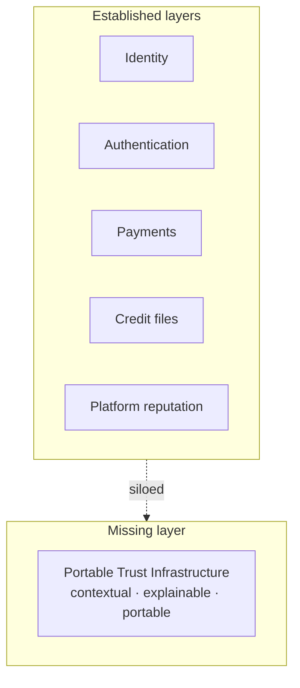
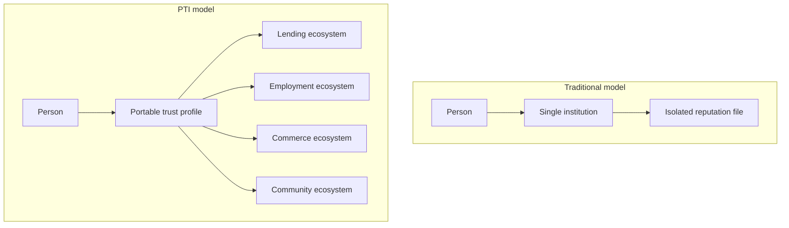

import SpecHero from '@site/src/components/SpecHero';

<SpecHero
  kicker="Category definition"
  title="Why Portable Trust Infrastructure Exists"
  lead="Identity, payments, and credit answer important questions — but not how trust signals move responsibly across ecosystems."
  badges={[
    {label: 'Infrastructure layer', variant: 'normative'},
    {label: 'Problem statement', variant: 'default'},
  ]}
/>

## The problem

Trust in digital systems is **fragmented**.

- Credibility built with one lender stays with that lender
- Rental history rarely reaches the next landlord
- Community and informal economic activity is invisible to formal decision systems
- Each institution **rebuilds** identity resolution, event schemas, scoring, consent, and audit from scratch

People **repeatedly prove themselves**. Organizations **duplicate** trust infrastructure instead of sharing interoperable semantics.

## Existing layers

Digital infrastructure matured in **partial answers**:

| Layer | Question answered |
|-------|-------------------|
| **Identity** | Who are you? |
| **Authentication** | Can you access this session or resource? |
| **Payments** | Can value move? |
| **Credit systems** | What formal financial history exists? |
| **Reputation systems** | What do others think on this platform? |

Each solves a real problem. None answers the cross-cutting institutional question:

> **How can trust signals move securely and responsibly across digital ecosystems?**

## The missing layer

**Portable Trust Infrastructure (PTI)** is that missing **infrastructure layer**.

PTI separates **trust production** (partners and institutions emitting verified activity) from **trust consumption** (decision-time lookups with explainability). It assigns portable subject identity (`pti_id`), **isolates life-area contexts**, and preserves **provenance** so outcomes are auditable — not opaque scores.

PTI is **not**:

- A credit bureau replacement
- A single vendor wallet
- A social rating app

PTI **is** a specification for how trust intelligence can be **produced, exchanged, resolved, and consumed** under governance — by any compatible implementation.

## What changes with PTI

| Without PTI | With PTI |
|-------------|----------|
| Trust trapped in silos | Context-scoped signals portable across institutions |
| Opaque scores | Explainable outcomes with evidence chains |
| Repeated KYC and re-proof | Persistent `pti_id` with governed lookups |
| Ad hoc integrations | Normative event and lookup contracts (RFCs) |

## Traditional vs PTI model

## Continue reading

| Topic | Link |
|-------|------|
| Historical foundation | [PTI Origin](/pti/origin/) |
| Design principles | [Core design principles](/pti/introduction/design-principles) |
| Architecture stack | [Trust infrastructure stack](/pti/architecture-stack/) |
| Normative specification | [PTI Specification v1.0](/pti/specification/v1.0/) |
| Build a compatible system | [Build Your Own PTI](/pti/build-your-pti/) |
| Reference implementation | [TumiTrust](/pti/reference-implementation/) |

Also see [Problems with existing systems](/pti/introduction/problems-with-existing-systems) for detailed comparisons.
